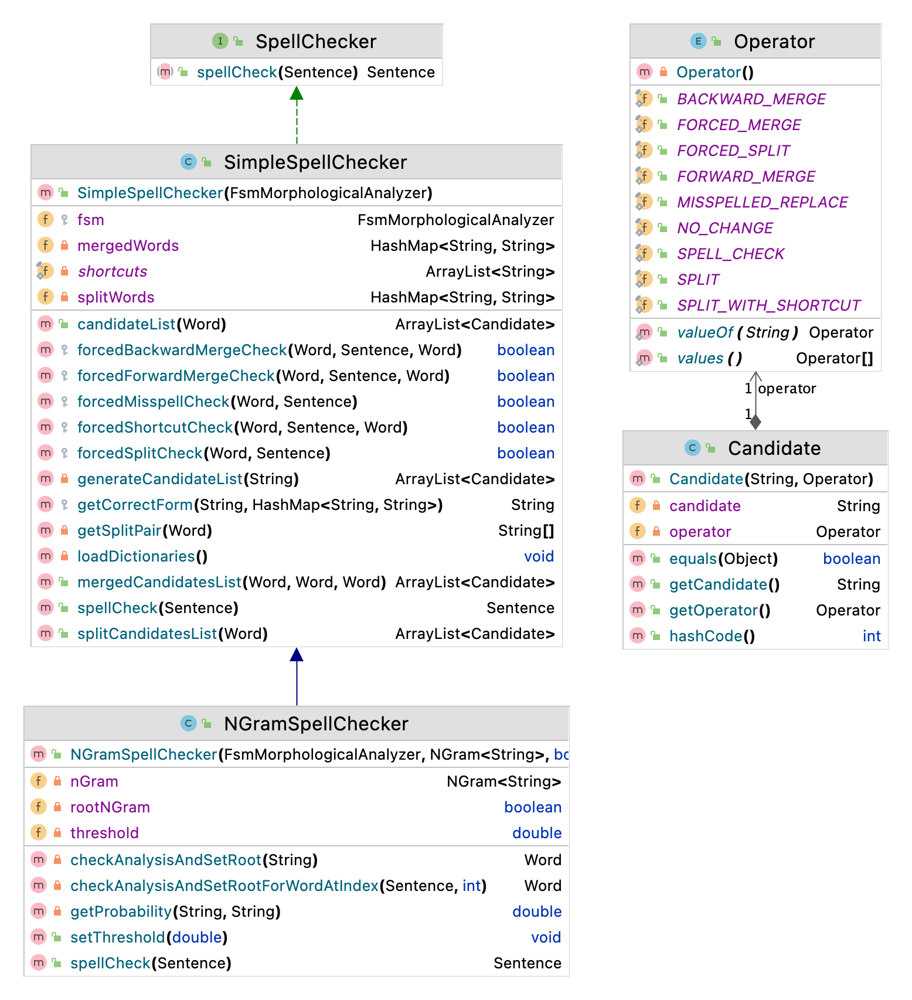

Turkish SpellChecker
============

This tool is a spelling checker for Modern Turkish. It detects spelling errors and corrects them appropriately, through its list of misspellings and matching to the Turkish dictionary.

Video Lectures 
============

Class Diagram
============

For Developers
============

You can also see [Python](https://github.com/starlangsoftware/TurkishSpellChecker-Py), [Cython](https://github.com/starlangsoftware/TurkishSpellChecker-Cy), [C++](https://github.com/starlangsoftware/TurkishSpellChecker-CPP), [Swift](https://github.com/starlangsoftware/TurkishSpellChecker-Swift), [Js](https://github.com/starlangsoftware/TurkishSpellChecker-Js), or [C#](https://github.com/starlangsoftware/TurkishSpellChecker-CS) repository.

## Requirements

* [Java Development Kit 8 or higher](#java), Open JDK or Oracle JDK
* [Maven](#maven)
* [Git](#git)

### Java 

To check if you have a compatible version of Java installed, use the following command:

    java -version
    
If you don't have a compatible version, you can download either [Oracle JDK](https://www.oracle.com/technetwork/java/javase/downloads/jdk8-downloads-2133151.html) or [OpenJDK](https://openjdk.java.net/install/)    

### Maven
To check if you have Maven installed, use the following command:

    mvn --version
    
To install Maven, you can follow the instructions [here](https://maven.apache.org/install.html).     

### Git

Install the [latest version of Git](https://git-scm.com/book/en/v2/Getting-Started-Installing-Git).

## Download Code

In order to work on code, create a fork from GitHub page. 
Use Git for cloning the code to your local or below line for Ubuntu:

	git clone <your-fork-git-link>

A directory called SpellChecker will be created. Or you can use below link for exploring the code:

	git clone https://github.com/starlangsoftware/TurkishSpellChecker.git

## Open project with IntelliJ IDEA

Steps for opening the cloned project:

* Start IDE
* Select **File | Open** from main menu
* Choose `SpellChecker/pom.xml` file
* Select open as project option
* Couple of seconds, dependencies with Maven will be downloaded. 

## Compile

**From IDE**

After being done with the downloading and Maven indexing, select **Build Project** option from **Build** menu. After compilation process, user can run `SpellChecker`.

**From Console**

Use below line to generate jar file:

     mvn install

## Maven Usage

        <dependency>
            <groupId>io.github.starlangsoftware</groupId>
            <artifactId>SpellChecker</artifactId>
            <version>1.0.14</version>
        </dependency>

For Developers
============

+ [Creating SpellChecker](#creating-spellchecker)
+ [Spell Correction](#spell-correction)

## Creating SpellChecker

SpellChecker finds spelling errors and corrects them in Turkish. There are two types of spell checker available:

* `SimpleSpellChecker`
    
    * To instantiate this, a `FsmMorphologicalAnalyzer` is needed. 
        
            FsmMorphologicalAnalyzer fsm = new FsmMorphologicalAnalyzer();
            SpellChecker spellChecker = new SimpleSpellChecker(fsm);   
     
* `NGramSpellChecker`,
    
    * To create an instance of this, both a `FsmMorphologicalAnalyzer` and a `NGram` is required. 
    
    * `FsmMorphologicalAnalyzer` can be instantiated as follows:
        
            FsmMorphologicalAnalyzer fsm = new FsmMorphologicalAnalyzer();
    
    * `NGram` can be either trained from scratch or loaded from an existing model.
        
        * Training from scratch:
                
                Corpus corpus = new Corpus("corpus.txt"); 
                NGram ngram = new NGram(corpus.getAllWordsAsArrayList(), 1);
                ngram.calculateNGramProbabilities(new LaplaceSmoothing());
                
        *There are many smoothing methods available. For other smoothing methods, check [here](https://github.com/olcaytaner/NGram).*       
        * Loading from an existing model:
     
                NGram ngram = new NGram("ngram.txt");
		        ngram.calculateNGramProbabilities(new LaplaceSmoothing());
		
	*For further details, please check [here](https://github.com/starlangsoftware/NGram).*        
            
    * Afterwards, `NGramSpellChecker` can be created as below:
        
            SpellChecker spellChecker = new NGramSpellChecker(fsm, ngram);
     

## Spell Correction

Spell correction can be done as follows:

    Sentence sentence = new Sentence("Dıktor olaç yazdı");
    Sentence corrected = spellChecker.spellCheck(sentence);
    System.out.println(corrected);
    
Output:

    Doktor ilaç yazdı
