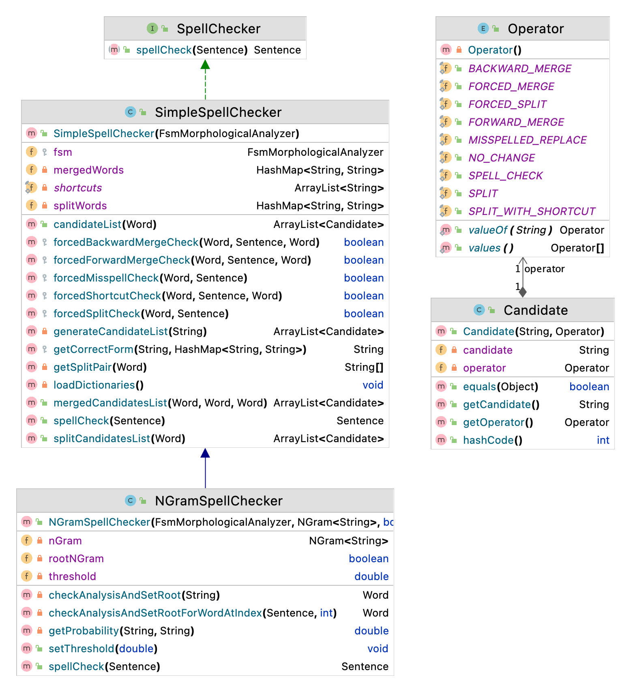

Turkish SpellChecker
============

This tool is a spelling checker for Modern Turkish. It detects spelling errors and corrects them appropriately, through its list of misspellings and matching to the Turkish dictionary.

Video Lectures 
============

[](https://youtu.be/wKwTKv6Jlo0)

For Developers
============

You can also see [Python](https://github.com/starlangsoftware/TurkishSpellChecker-Py), [Cython](https://github.com/starlangsoftware/TurkishSpellChecker-Cy), [C++](https://github.com/starlangsoftware/TurkishSpellChecker-CPP), [C](https://github.com/starlangsoftware/TurkishSpellChecker-C), [Swift](https://github.com/starlangsoftware/TurkishSpellChecker-Swift), [Js](https://github.com/starlangsoftware/TurkishSpellChecker-Js), or [C#](https://github.com/starlangsoftware/TurkishSpellChecker-CS) repository.

## Requirements

* [Java Development Kit 8 or higher](#java), Open JDK or Oracle JDK
* [Maven](#maven)
* [Git](#git)

### Java 

To check if you have a compatible version of Java installed, use the following command:

    java -version
    
If you don't have a compatible version, you can download either [Oracle JDK](https://www.oracle.com/technetwork/java/javase/downloads/jdk8-downloads-2133151.html) or [OpenJDK](https://openjdk.java.net/install/)    

### Maven
To check if you have Maven installed, use the following command:

    mvn --version
    
To install Maven, you can follow the instructions [here](https://maven.apache.org/install.html).     

### Git

Install the [latest version of Git](https://git-scm.com/book/en/v2/Getting-Started-Installing-Git).

## Download Code

In order to work on code, create a fork from GitHub page. 
Use Git for cloning the code to your local or below line for Ubuntu:

	git clone <your-fork-git-link>

A directory called SpellChecker will be created. Or you can use below link for exploring the code:

	git clone https://github.com/starlangsoftware/TurkishSpellChecker.git

## Open project with IntelliJ IDEA

Steps for opening the cloned project:

* Start IDE
* Select **File | Open** from main menu
* Choose `SpellChecker/pom.xml` file
* Select open as project option
* Couple of seconds, dependencies with Maven will be downloaded. 

## Compile

**From IDE**

After being done with the downloading and Maven indexing, select **Build Project** option from **Build** menu. After compilation process, user can run `SpellChecker`.

**From Console**

Use below line to generate jar file:

     mvn install

## Maven Usage

        <dependency>
            <groupId>io.github.starlangsoftware</groupId>
            <artifactId>SpellChecker</artifactId>
            <version>1.0.27</version>
        </dependency>

For Developers
============

+ [Creating SpellChecker](#creating-spellchecker)
+ [Spell Correction](#spell-correction)

## Creating SpellChecker

SpellChecker finds spelling errors and corrects them in Turkish. There are two types of spell checker available:

* `SimpleSpellChecker`
    
    * To instantiate this, a `FsmMorphologicalAnalyzer` is needed. 
        
            FsmMorphologicalAnalyzer fsm = new FsmMorphologicalAnalyzer();
            SpellChecker spellChecker = new SimpleSpellChecker(fsm);   
     
* `NGramSpellChecker`,
    
    * To create an instance of this, both a `FsmMorphologicalAnalyzer` and a `NGram` is required. 
    
    * `FsmMorphologicalAnalyzer` can be instantiated as follows:
        
            FsmMorphologicalAnalyzer fsm = new FsmMorphologicalAnalyzer();
    
    * `NGram` can be either trained from scratch or loaded from an existing model.
        
        * Training from scratch:
                
                Corpus corpus = new Corpus("corpus.txt"); 
                NGram ngram = new NGram(corpus.getAllWordsAsArrayList(), 1);
                ngram.calculateNGramProbabilities(new LaplaceSmoothing());
                
        *There are many smoothing methods available. For other smoothing methods, check [here](https://github.com/olcaytaner/NGram).*       
        * Loading from an existing model:
     
                NGram ngram = new NGram("ngram.txt");
		        ngram.calculateNGramProbabilities(new LaplaceSmoothing());
		
	*For further details, please check [here](https://github.com/starlangsoftware/NGram).*        
            
    * Afterwards, `NGramSpellChecker` can be created as below:
        
            SpellChecker spellChecker = new NGramSpellChecker(fsm, ngram);
     

## Spell Correction

Spell correction can be done as follows:

    Sentence sentence = new Sentence("Dıktor olaç yazdı");
    Sentence corrected = spellChecker.spellCheck(sentence);
    System.out.println(corrected);
    
Output:

    Doktor ilaç yazdı

For Contibutors
============

### Class Diagram



### pom.xml file
1. Standard setup for packaging is similar to:
```
    <groupId>io.github.starlangsoftware</groupId>
    <artifactId>Amr</artifactId>
    <version>1.0.0</version>
    <packaging>jar</packaging>
    <name>NlpToolkit.Amr</name>
    <description>Abstract Meaning Representation Library</description>
    <url>https://github.com/StarlangSoftware/Amr</url>

    <organization>
        <name>io.github.starlangsoftware</name>
        <url>https://github.com/starlangsoftware</url>
    </organization>

    <licenses>
        <license>
            <name>The Apache Software License, Version 2.0</name>
            <url>http://www.apache.org/licenses/LICENSE-2.0.txt</url>
        </license>
    </licenses>

    <developers>
        <developer>
            <name>Olcay Taner Yildiz</name>
            <email>olcay.yildiz@ozyegin.edu.tr</email>
            <organization>Starlang Software</organization>
            <organizationUrl>http://www.starlangyazilim.com</organizationUrl>
        </developer>
    </developers>

    <scm>
        <connection>scm:git:git://github.com/starlangsoftware/amr.git</connection>
        <developerConnection>scm:git:ssh://github.com:starlangsoftware/amr.git</developerConnection>
        <url>http://github.com/starlangsoftware/amr/tree/master</url>
    </scm>

    <properties>
        <maven.compiler.source>1.8</maven.compiler.source>
        <maven.compiler.target>1.8</maven.compiler.target>
        <project.build.sourceEncoding>UTF-8</project.build.sourceEncoding>
    </properties>
```
2. Only top level dependencies should be added. Do not forget junit dependency.
```
    <dependencies>
        <dependency>
            <groupId>io.github.starlangsoftware</groupId>
            <artifactId>AnnotatedSentence</artifactId>
            <version>1.0.78</version>
        </dependency>
        <dependency>
            <groupId>junit</groupId>
            <artifactId>junit</artifactId>
            <version>4.13.1</version>
            <scope>test</scope>
        </dependency>
    </dependencies>
```
3. Maven compiler, gpg, source, javadoc plugings should be added.
```
	<plugin>
		<groupId>org.apache.maven.plugins</groupId>
		<artifactId>maven-compiler-plugin</artifactId>
		<version>3.6.1</version>
		<configuration>
			<source>1.8</source>
			<target>1.8</target>
		</configuration>
	</plugin>
	<plugin>
		<groupId>org.apache.maven.plugins</groupId>
		<artifactId>maven-gpg-plugin</artifactId>
		<version>1.6</version>
		<executions>
			<execution>
				<id>sign-artifacts</id>
				<phase>verify</phase>
				<goals>
					<goal>sign</goal>
				</goals>
			</execution>
		</executions>
	</plugin>
	<plugin>
		<groupId>org.apache.maven.plugins</groupId>
		<artifactId>maven-source-plugin</artifactId>
		<version>2.2.1</version>
		<executions>
			<execution>
				<id>attach-sources</id>
				<goals>
					<goal>jar-no-fork</goal>
				</goals>
			</execution>
		</executions>
	</plugin>
	<plugin>
		<groupId>org.apache.maven.plugins</groupId>
		<artifactId>maven-javadoc-plugin</artifactId>
		<configuration>
			<source>8</source>
		</configuration>
		<version>3.10.0</version>
		<executions>
			<execution>
				<id>attach-javadocs</id>
				<goals>
					<goal>jar</goal>
				</goals>
			</execution>
		</executions>
	</plugin>
```
4. Currently publishing plugin is Sonatype.
```
	<plugin>
		<groupId>org.sonatype.central</groupId>
		<artifactId>central-publishing-maven-plugin</artifactId>
		<version>0.8.0</version>
		<extensions>true</extensions>
		<configuration>
			<publishingServerId>central</publishingServerId>
			<autoPublish>true</autoPublish>
		</configuration>
	</plugin>
```
5. For UI jar files use assembly plugins.
```
	<plugin>
		<groupId>org.apache.maven.plugins</groupId>
		<artifactId>maven-assembly-plugin</artifactId>
		<version>2.2-beta-5</version>
		<executions>
			<execution>
				<id>sentence-dependency</id>
				<phase>package</phase>
				<goals>
					<goal>single</goal>
				</goals>
				<configuration>
					<archive>
						<manifest>
							<mainClass>Amr.Annotation.TestAmrFrame</mainClass>
						</manifest>
					</archive>
					<finalName>amr</finalName>
				</configuration>
			</execution>
		</executions>
		<configuration>
			<descriptorRefs>
				<descriptorRef>jar-with-dependencies</descriptorRef>
			</descriptorRefs>
			<appendAssemblyId>false</appendAssemblyId>
		</configuration>
	</plugin>
```
### Resources
1. Add resources to the resources subdirectory. These will include image files (necessary for UI), data files, etc.
   
### Java files
1. Do not forget to comment each function.
```
    /**
     * Returns the value of a given layer.
     * @param viewLayerType Layer for which the value questioned.
     * @return The value of the given layer.
     */
    public String getLayerInfo(ViewLayerType viewLayerType){
```
2. Function names should follow caml case.
```
    public MorphologicalParse getParse()
```
3. Write toString methods, if necessary.
4. Use Junit for writing test classes. Use test setup if necessary.
```
public class AnnotatedSentenceTest {
    AnnotatedSentence sentence0, sentence1, sentence2, sentence3, sentence4;
    AnnotatedSentence sentence5, sentence6, sentence7, sentence8, sentence9;

    @Before
    public void setUp() throws Exception {
        sentence0 = new AnnotatedSentence(new File("sentences/0000.dev"));
```
